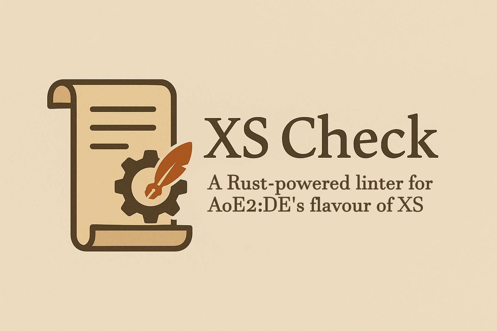
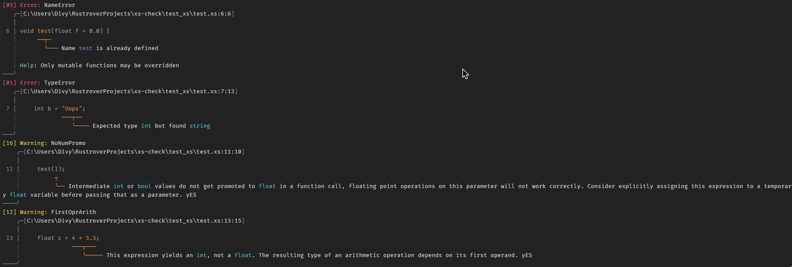

# XS Check: A linter  for AoE2:DE's flavour of XS.

<center>  </center>

## Installation

You may download and use the prebuilt binaries from [here](https://github.com/Divy1211/xs-check/releases/latest)

Or instead, if you have rust installed and prefer to build it from source, you can simply run:

```sh
cargo install --git https://github.com/Divy1211/xs-check/xsc-cli
```

This is recommended, as it will automatically add the binary to your system's path variable.

## Usage

Suppose you have an XS file like so:

`test.xs`
```cpp
void test(float f = 0.0) {
    int cp = xsGetContextPlayer();
    xsChatData("cp: %d", cp);
}

void test(float f = 0.0) {
    int b = "Oops";
}

void main() {
    test(1);

    float c = 4 + 5.5;
}
```

Invoke the binary on the file:

```sh
xs-check ./test.xs 
```

And it will generate an output with all the errors it finds:



You may also tell it to ignore warnings (errors cannot be ignored) with a comma separated list:

```sh
xs-check file.xs --ignores warning1,warning2
```

The name used to ignore the warning is the same name that is printed in the first line of the warning. Ignoring the `DiscardedFn` warning may be useful at times

## Cool Maths

Note: GitHub does not render all the latex correctly, read these docs here: https://divy1211.github.io/xs-check/

| Topic            | Subtopic                                                    |
|------------------|-------------------------------------------------------------|
| Parsing          | [XS Tokens](maths/docs/parsing/xs_tokens.md)                |
| Parsing          | [XS Keywords](maths/docs/parsing/xs_keywords.md)            |
| Parsing          | [XS Grammar](maths/docs/parsing/xs_grammar.md)              |
| Static Analysis  | [XS Type Checking](maths/docs/static/xs_type_chk.md)        |
| Dynamic Analysis | [XS Operational Semantics](maths/docs/dynamic/xs_op_sem.md) |
| Code Generation  | [XS Maximal Munch](maths/docs/code_gen/xs_mm.md)            |

[//]: # (| Code Generation  | [IR to Byte Code]&#40;maths/docs/code_gen/xs_bc.md&#41;             |)

[//]: # (| Runtime          | [XS Virtual Machine]&#40;maths/docs/xs_vm/xs_rt.md&#41;             |)

[//]: # (| Byte Code        | [XS Virtual Machine]&#40;maths/docs/xs_vm/xs_ops.md&#41;            |)

[//]: # (| Static Analysis  | [XS Type Inference]&#40;./maths/static/xs_type_inf.md&#41;       |)

[//]: # (| Static Analysis  | [XS Sign Analysis]&#40;./maths/static/xs_sign.md&#41;            |)

[//]: # (| Static Analysis  | [XS Liveness Analysis]&#40;./maths/static/xs_liveness.md&#41;    |)
